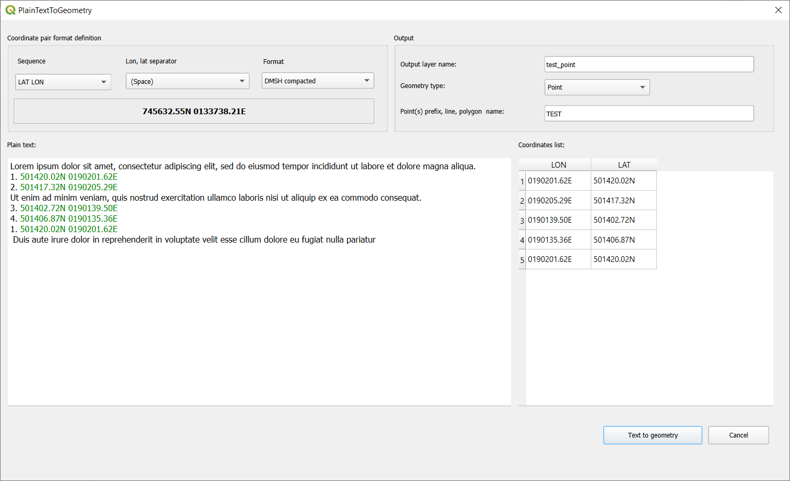
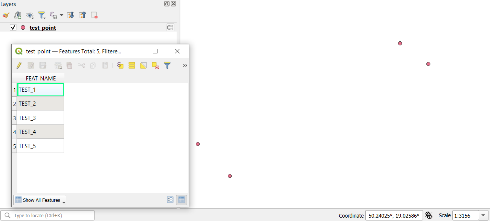
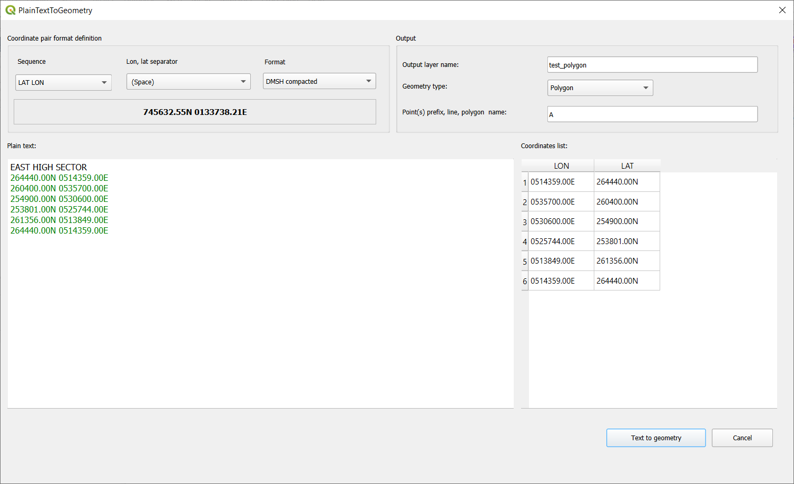
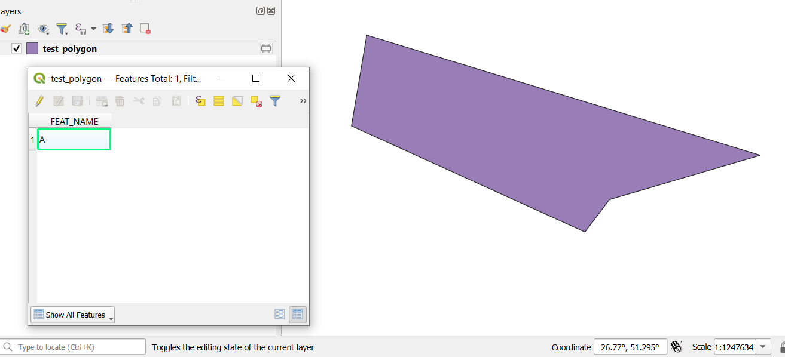

# PlainTextToGeometry

Extract coordinates from plain text and turn them into Points, Lines, or Polygons in QGIS — ready to map, edit, and analyze.

Usage examples:









## For Git users <a name=git_user>

1. Copy repository to the local disk
2. cd dir to the main dir of the `qgis3-plain-text-to-geometry` repository
3. Create zip file from the `plaintext_to_geometry` subdirectory
4. QGIS - install plugin via Plugin manager/Installer  
   4.1 Open menu: `Plugins > Manage and Install Plugins`  
   4.2 Choose `Install from ZIP`  
   4.3 Select file `plaintext_to_geometry.zip`  
   4.4 Press `Install Plugin button` 
5. Plugin is installed: `Plugins > PlainTextToGeometry`

## For no Git users <a name=no_git_user>

1. Download repository via `Code > Download ZIP`
2. Unzip to `qgis3-plain-text-to-geometry` directory
3. cd dir to the unzipped directory
4. Create zip file from the `plaintext_to_geometry` subdirectory
5. QGIS - install plugin via Plugin manager/Installer  
   5.1 Open menu: `Plugins > Manage and Install Plugins`   
   5.2 Choose `Install from ZIP`  
   5.3 Select file `plaintext_to_geometry.zip`  
   5.4 Press `Install Plugin button`  
6. Plugin is installed: `Plugins > PlainTextToGeometry`

# Development setup

## Prerequisites

* QGIS >=3.34, < 4.0 (provides Python 3.12 amd PyQT5)
* Poetry installed

## Setting up the development environment

> Replace `<QGIS_ROOT_PATH>` in the commands below with the actual path to QGIS on your host.

1. Create a virtual environment using the QGIS Python installation:
```powershell
& "<QGIS_ROOT_PATH>\apps\Python312\python.exe" -m venv .venv --system-site-packages
```

2. Verify that PyQt5 is inherited from the system site packages:
```powershell
& .venv\Scripts\python.exe -c "import PyQt5; print(PyQt5.__file__)"
```

3. Install the project dependencies:
```powershell
poetry install
```
4. Add the QGIS Python path to the virtual environment:
```powershell
Add-Content ".venv\Lib\site-packages\qgis_paths.pth" "<QGIS_ROOT_PATH>\apps\qgis-ltr\python"
```
5. Verify that both PyQt5 and QGIS are importable:
```powershell
& .venv\Scripts\python.exe -c "import PyQt5; import qgis; print('OK')"
```
6. Configure your IDE:
Set the Python interpreter to: `.venv\Scripts\python.exe`
