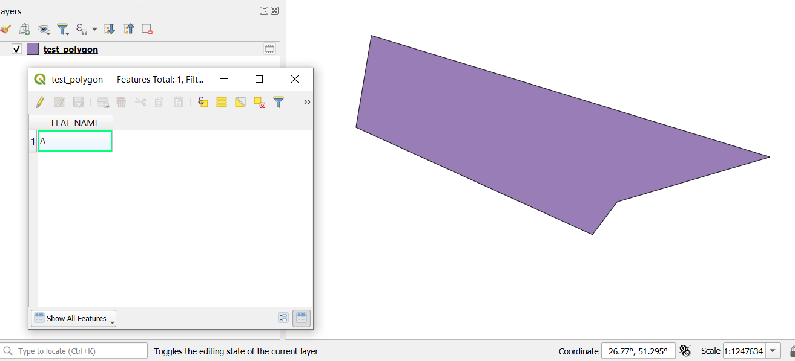

# PlainTextToGeometry

QGIS plugin to create geometries (Point, Line, Polygon) based on extracted coordinates from plain text.

Usage examples:

## For Git users <a name=git_user>

1. Copy repository to the local disk
2. cd dir to the main dir of the `qgis3-plain-text-to-geometry` repository
3. Create zip file from the `plaintext_to_geometry` subdirectory
4. QGIS - install plugin via Plugin manager/Installer  
   4.1 Open menu: `Plugins > Manage and Install Plugins`  
   4.2 Choose `Install from ZIP`  
   4.3 Select file `plaintext_to_geometry.zip`  
   4.4 Press `Install Plugin button` 
5. Plugin is installed: `Plugins > PlainTextToGeometry`

## For no Git users <a name=no_git_user>

1. Download repository via `Code > Download ZIP`
2. Unzip to `qgis3-plain-text-to-geometry` directory
3. cd dir to the unzipped directory
4. Create zip file from the `plaintext_to_geometry` subdirectory
5. QGIS - install plugin via Plugin manager/Installer  
   5.1 Open menu: `Plugins > Manage and Install Plugins`   
   5.2 Choose `Install from ZIP`  
   5.3 Select file `plaintext_to_geometry.zip`  
   5.4 Press `Install Plugin button`  
6. Plugin is installed: `Plugins > PlainTextToGeometry`